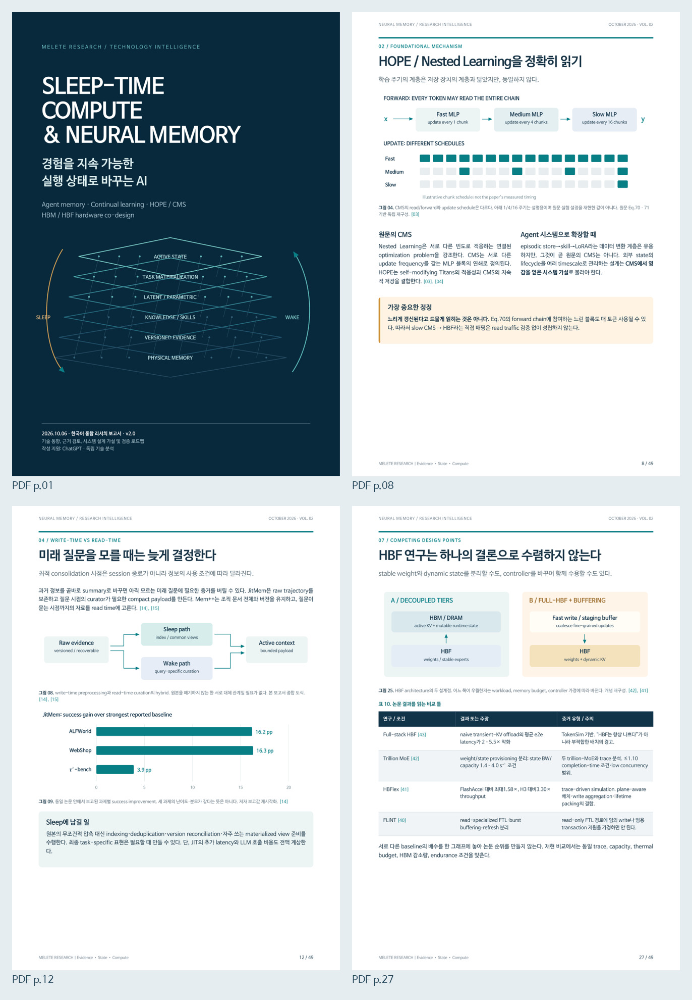

# Sleep-time Compute & Neural Memory — 2026-10-06

49쪽 한국어 PDF와 재현 가능한 편집 원본을 보존하는 별도 연구 리포트다.
기존 Neural Memory 모노그래프 및 Sleep-Time Compute v2를 대체하지 않는다.

| 자료 | 링크 |
|---|---|
| 한국어 PDF | [리포트](Neural_Memory_Report_2026-10-06_KO.pdf) |
| 대표 페이지 미리보기 | [JPG](Neural_Memory_Report_Preview.jpg) |
| 편집 원본 전체 ZIP | [소스 패키지](Neural_Memory_Report_Source_Package.zip) |
| 편집 가능한 소스 | [source/](source/) |
| 그림·표 색인 | [FIGURE_TABLE_INDEX.md](FIGURE_TABLE_INDEX.md) |
| 제작 단계의 출처 대조 기록 | [SOURCE_AUDIT.md](SOURCE_AUDIT.md) |
| 게시·무결성 기록 | [PUBLICATION.json](PUBLICATION.json) · [manifest.json](manifest.json) · [SHA256SUMS](SHA256SUMS) |



## 보존 및 검증

PDF는 앞서 완성한 파일을 동일 소스로 재빌드했으며 SHA-256이 원본과 정확히 일치한다.
미리보기는 그 PDF에서 새로 렌더링했고, ZIP은 보존한 편집 소스와 생성 산출물을 다시 묶었다.
따라서 PDF의 동일성은 검증했지만 JPG·ZIP이 이전 파일과 byte-identical하다고 주장하지 않는다.
원본 build code, CSS, reference JSON/CSV, chart data와 source audit은 SHA-256으로 대조했다.

이번 동기화는 문헌 재조사나 실험 재현이 아니다. `SOURCE_AUDIT.md`의 검토 기록은 원본 제작 단계의 기록이다.
PDF 내부의 제작 당시 표기와 연구 내용은 그대로 보존했다. 현재 정식 보관 위치는 이 저장소다.
글꼴 파일·원문 논문 PDF는 이 신규 패키지에 재배포하지 않는다.

```bash
sha256sum -c SHA256SUMS
```

재편집 방법과 근거의 한계는 [source/README.md](source/README.md)에 있다.
