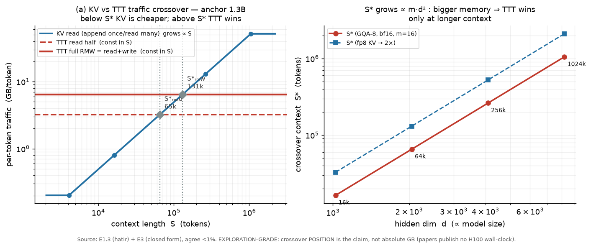
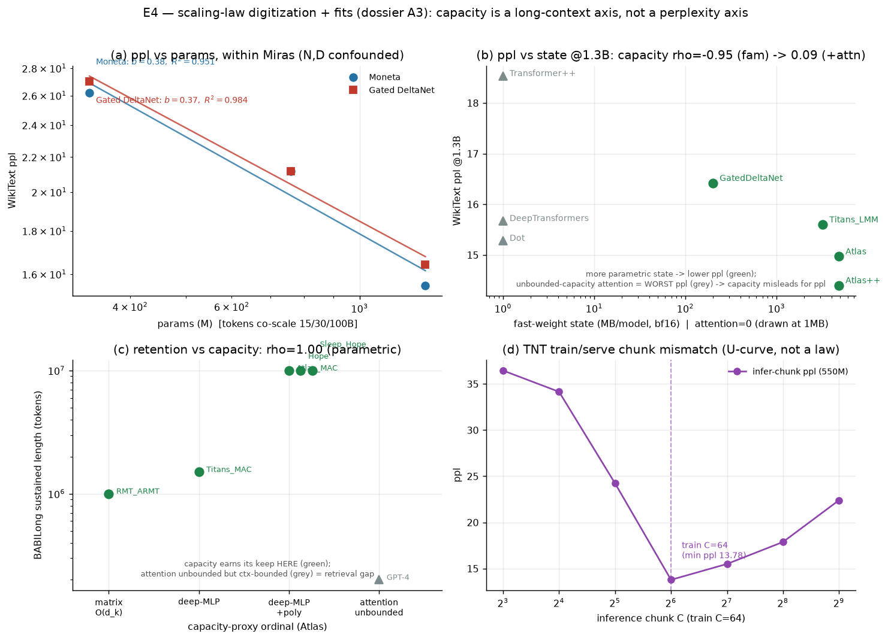
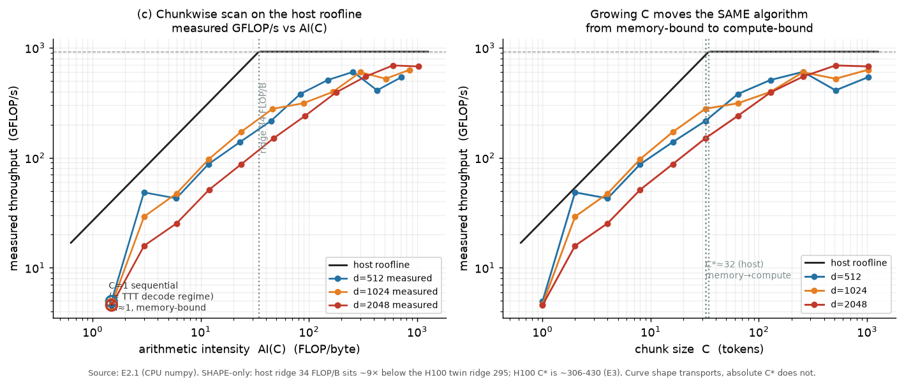

# ch19. Scaling 분석과 memory-centric 모델의 후보 scaling law

> **이 장의 목표** — 독자가 이 장을 마치면 (1) 여섯 편이 공개한 ppl-vs-{params, tokens, context} 점을 하나의 표로 digitize하고 그 비교가 어디까지 정당한지(tokenizer 이질성·setting_group 경계) 판별할 수 있고, (2) 왜 params·tokens 두 축만으로는 이 라인의 scaling을 기술할 수 없는지 — **state-bytes**와 **capacity**($O(d_k^p)$)가 빠진 두 개의 독립 축임을 — 논증할 수 있으며, (3) 그 공개 점에 실제로 후보 법칙을 fit한 결과(E4)를 읽고, capacity 축이 raw state-bytes 대비 예측력을 **어디서** 더하고 **어디서** 더하지 못하는지 정량으로 판정할 수 있고, (4) decode 비용·crossover·quality 각각에 대한 후보 scaling law의 형태를 진술하며 A3 falsification 조건과 실제 검정 결과를 대조할 수 있어야 한다.
> **왜 필요한가** — 18장은 완성형을 workload로, workload를 D4 pair thesis로 내렸고, Part III를 일곱 장으로 폈다. 이 장은 그 첫 축이다. scaling law는 inference 엔지니어가 fleet을 sizing할 때 쓰는 도구인데, 이 라인은 여섯 편에 걸쳐 quality scaling을 단 한 번도 law로 fit하지 않았다(dossier §3.2 공백 1: "스케일"). 이 장은 그 빈자리에 두 개의 새 축을 세우고, 그 축들이 pair thesis의 decode 절반과 어떻게 맞물리는지를 실측 claim으로 뒷받침한다.

## 19.1 Bridge-in: scaling law는 왜 두 축이 모자란가

18장의 [평가]는 이 라인의 배포를 "세션 상태가 per-session mutable weights인 continually-learning LLM"으로 읽었다. inference 엔지니어가 그런 시스템의 fleet을 계획하려면 익숙한 두 질문에 답해야 한다: **주어진 예산에서 어떤 품질이 나오는가**(quality scaling), 그리고 **주어진 품질을 서빙하는 데 자원이 얼마나 드는가**(cost scaling). transformer 세계에서 두 질문의 도구는 각각 Chinchilla식 법칙 $\mathrm{L}(N,D)$(Hoffmann et al. 2022, arXiv:2203.15556)과 KV cache sizing이다 — 둘 다 params $N$과 tokens $D$라는 두 축 위에 산다.

이 라인은 그 두 축을 깨뜨린다. 정확히는, 두 축을 **불충분하게** 만든다. 이유는 18장에서 이미 나왔다: state가 KV cache가 아니라 weights이고(완성형 성분 1), 그 weights의 크기가 params와 **분리된** 독립 knob이며(§18.3의 decode 절반), 같은 $(N, D)$ 아래서도 architecture class가 바뀌면 memory **capacity**가 $O(d_k)$에서 무한대까지 움직인다(→ 14장의 $\phi^*$). 즉 params·tokens는 quality의 일부만, cost의 일부만 설명한다. 이 장의 명제는 하나다: **memory-centric 모델의 scaling law는 params·tokens 위에 state-bytes와 capacity라는 두 개의 일급 축을 얹어야 완결된다.** 그리고 그 두 축이 정확히 pair thesis의 decode 절반이 사는 곳이다.

이 장은 그 명제를 세 단계로 세운다. 먼저 여섯 편의 공개 점을 digitize하고(§19.2), 그 점들을 하나의 fit 위에 올릴 때 넘을 수 없는 방법론적 선 — tokenizer 이질성과 setting_group 경계 — 을 못박는다(§19.3). 그다음 두 개의 빠진 축(state-bytes §19.4, capacity §19.6)을 세우되, 그 사이에 이 장의 정량 백본을 끼운다: 공개 점에 후보 법칙을 **실제로 fit한** E4의 결과(§19.5)다. E4는 A3의 핵심 질문 — "capacity는 raw state-bytes 대비 예측력을 더하는가?" — 을 digitize된 공개 점 위에서 rank-correlation으로 검정하며, 그 답은 **축마다 다르다.** 마지막으로 후보 법칙의 형태(§19.7)와 A3 falsification 조건 대 실제 판정(§19.8)을 대조한다.

## 19.2 여섯 편의 공개 scaling 점을 digitize한다

먼저 재료를 모은다. 여섯 편이 본문·표에 공개한, 서로 다른 스케일에서의 품질 점을 하나의 표로 옮긴다(표 19-1). 원문 수치이므로 출처를 병기하고, 반올림하지 않는다.

표 19-1 — 여섯 편의 공개 품질 점(from-scratch LM). ppl은 Wiki / LAMBADA, acc는 common-sense 평균. tokenizer 열이 비교 가능성의 관문이다.

| 모델 | 스케일 | tokens | tokenizer | Wiki ppl | avg acc | 출처 |
|---|---|---|---|---|---|---|
| Titans (LMM) | 760M | 30B | Llama-2 | 20.04 | 51.56 | [Titans Table 1] |
| Titans (LMM) | 340M | 15B | Llama-2 | — | 46.17 | [Titans Table 1] |
| Atlas | 1.3B | 100B | T5-32K | 14.97 | 57.62 | [Atlas] |
| Atlas++ | 1.3B | 100B | T5-32K | 14.40 | 58.03 | [Atlas] |
| Titans (재실행) | 1.3B | 100B | T5-32K | 15.60 | 56.82 | [Atlas] |
| Gated DeltaNet(이하 GDN) | 1.3B | 100B | T5-32K | 16.42 | 55.32 | [Atlas] |
| Transformer++ | 1.3B | 100B | T5-32K | 18.53 | 52.25 | [Atlas] |
| Atlas | 760M | 30B | T5-32K | 19.97 | 52.77 | [Atlas Table 6] |
| Hope | 1.3B | 100B | 32K | 14.39 | 58.04 | [NL] |
| Titans (재실행) | 1.3B | 100B | 32K | — | 56.82 | [NL] |
| Hope | 760M | 30B | 32K | 18.68 | 52.28 | [NL] |
| TNT (best) | 150M | 10B | T5-32K | — | ~41.0 | [TNT Table 2] |

이 표를 세로로 읽으면 스케일에 따른 단조 개선이 드러난다: Atlas의 avg acc는 760M 52.77 → 1.3B 57.62로, Hope는 760M 52.28 → 1.3B 58.04로 오른다. [NL]은 "gains grow with scale"을 명시하고, [Atlas Fig. 8]은 params와 training context 양쪽에서 baseline 대비 우호적 scaling을 보고한다 — **이 라인이 공개한 유일한 scaling-law 모양의 증거다.** 그러나 이 표를 fit하려면 먼저 가로 방향으로 어디까지 읽을 수 있는지를 결정해야 한다. 그것이 다음 절의 방법론이고, 이 장의 모든 정량 결과가 그 위에 선다.

## 19.3 방법론: tokenizer 이질성과 setting_group — fit의 경계가 왜 하나인가

표 19-1은 세로로는 읽히지만 가로로는 함부로 읽히지 않는다. **tokenizer 열이 이유다.** 이 절은 그 이유를 정량으로 못박고, 이 장이 어떤 fit을 legal하다고 부르는지의 규칙 — **setting_group** — 을 정의한다. 이후 §19.5의 모든 fit은 이 규칙 안에서만 계산된다.

**왜 tokenizer가 ppl을 비교 불가로 만드는가.** perplexity는 per-token cross-entropy의 지수 $\mathrm{ppl}=\exp(-\frac{1}{T}\sum_t \log p(x_t\mid x_{<t}))$인데, 여기서 token $x_t$의 단위 자체가 tokenizer의 vocabulary가 정한다. vocab이 다르면 같은 텍스트가 서로 다른 개수의 token으로 쪼개지고, 그러면 sum의 분모 $T$와 각 항의 정보량이 함께 달라진다 — 즉 **분모가 다른 두 척도의 ppl은 좌표계가 다르다.** Titans 원 논문의 점은 Llama-2 tokenizer로, Atlas·TNT의 T5, NL/Sleep의 32K vocab 점과 같은 축의 perplexity가 **아니다.** 따라서 "Titans 760M 20.04가 Atlas 1.3B 14.97보다 나쁘다"는 스케일 차이와 tokenizer 차이가 뒤섞인 무의미한 비교이며, 여기에 fit을 얹으면 exponent가 아니라 두 vocab의 압축률 차이를 재게 된다.

**setting_group: legal한 fit의 유일한 경계.** 그래서 이 장은 fit을 계산할 수 있는 최소 단위를 **하나의 setting_group** — 같은 논문 + 같은 tokenizer + 같은 data + 같은 metric — 으로 정의한다(E4의 fit 경계 규칙). 이 경계를 넘는 순간 fit은 exploration-grade조차 아니고, 좌표계 혼합이다. 이 규칙이 표 19-1을 세 종류의 비교로 분해한다.

1. **세로(within-setting) 대조 — legal.** 한 setting_group 안에서 스케일만 바꾼 점들. Miras의 Moneta·GDN을 FineWeb-Edu·WikiText ppl로 340M→760M→1.3B로 잰 계열이 여기다(§19.5 Group A). 이 계열은 fit이 가능하다 — 단 아래의 confound를 안고서.
2. **논문 내 재실행 baseline 대조 — legal.** 한 논문이 자기 protocol로 재실행한 baseline과의 대조. Atlas가 재실행한 Titans 1.3B 15.60 vs Atlas 14.97, 그리고 Atlas Table 2의 고정 1.3B cross-architecture 점 전부(§19.5 Group B).
3. **정렬된 논문 간 앵커 대조 — 제한적으로 legal.** tokenizer·데이터가 우연히 정렬된 논문 간 대조. 여기 한 개의 단단한 앵커가 있다: Atlas와 NL이 각각 재실행한 **Titans 1.3B의 avg acc가 56.82로 정확히 일치**한다(FineWeb 계열 + 32K vocab). 이 일치는 두 논문의 1.3B 점을 같은 축 위에 놓을 수 있게 해 주며, 그 위에서 Atlas++ 58.03과 Hope 58.04가 사실상 동률로 Titans 56.82를 넘는다는 **cross-architecture ordering**은 load-bearing하다.

**N,D confound: 세로 fit조차 순수 param law가 아니다.** 위 (1)의 세로 대조에도 함정이 하나 있다. 이 라인의 공개 계열은 params를 키울 때 tokens도 함께 키웠다 — Miras는 340M/15B → 760M/30B → 1.3B/100B로 $N$과 $D$가 **동시에** 자란다. 따라서 ppl-vs-params만 fit한 exponent는 param scaling과 token scaling이 뒤엉킨 값이지 순수 param law가 아니다. 정직한 축은 compute $\propto 6ND$이며(§19.5), params-only 지수는 **descriptive**로만 보고한다.

**왜 rho인가: tiny-N에서 정직한 통계.** 이 모든 setting_group은 점이 3–8개뿐이다. 그런 표본에서 최소제곱 exponent의 신뢰구간은 사실상 의미가 없다. 그래서 §19.5의 cross-architecture 검정은 continuous exponent 대신 **Spearman rank-correlation $\rho$**를 1급 통계로 쓴다 — 순서(ordering)만 읽고 크기는 읽지 않으므로 정직성 계약의 "비율·순서만 load-bearing" 원칙과 정확히 정렬한다. 보고되는 $p$값은 방향의 지표일 뿐 유의성 판정이 아니다.

> **[평가]** 이 절의 실질은 "비교 불가"라는 부정형 결론이 아니라, **정확히 무엇이 legal한지를 규정하는 경계**다. 넘어서는 안 되는 선은 표 19-1의 가로줄을 fitted exponent로 승격하는 것이다. 지지되는 것은 (i) setting_group 안의 descriptive fit, (ii) 재실행 baseline 대조, (iii) 56.82 앵커 위의 ordering — 이 셋뿐이다. §19.5는 이 세 종류 안에서만 움직이고, §19.8은 이 경계 자체가 A3 falsifier 1의 발효임을 보인다.

## 19.4 빠진 축 하나: state-bytes

params·tokens가 놓치는 첫 번째 축은 cost 쪽에 있다. transformer에서 서빙 상태(KV cache)는 $2\,L\,d$로 **문맥 길이** $L$에 비례해 자라고 params와는 다른 축이다 — 엔지니어는 이 사실에 익숙하다. memory-centric 모델에서 서빙 상태는 **fast-weight state**이고, 그 크기는 문맥에 무관하며 다음으로 고정된다:

$$
B_{\mathrm{state}} \;=\; m\,d^2\,L_{\mathrm{layer}}\cdot s
\tag{19-1}
$$

여기서 **state multiplier** $m$은 표준 deep memory의 상태 배수(§1.6; 2-layer MLP이면 $8d^2$, momentum 포함이면 $16d^2$), $d$는 model 폭, $L_{\mathrm{layer}}$는 layer 수(sequence 길이 $L$이 **아님**), $s$는 원소당 바이트다. anchor `neural-mem-1.3B`($d{=}2048$, $m{=}16$, $L_{\mathrm{layer}}{=}24$, bf16)에서 layer당 $16\cdot2048^2\cdot2 = 134\ \mathrm{MB}$, 전체 $B_{\mathrm{state}} \approx 3.2\ \mathrm{GB}$다(실험 E1.1/E3, 세 방법이 layer당 134 MB로 1% 이내 일치).

**$m$은 architecture class가 정하는 knob이다.** (19-1)에서 $d,L_{\mathrm{layer}}$가 params를 따라가는 동안, $m$은 **class에 따라** 독립적으로 움직인다. E4가 digitize한 class별 $m$(units of $d^2$/layer, bf16)은 다음과 같다: matrix memory(GDN)는 $m{=}1$, 표준 deep-MLP(Titans/TTT, $W_1{:}\,d{\times}4d$ + $W_2{:}\,4d{\times}d = 8d^2$)는 $m{=}8$, momentum·2nd-moment buffer를 더하면 $m{=}16$, poly feature map으로 key 차원을 부풀린 Atlas는 directional로 $m{\approx}24$, 그리고 attention은 fast-weight state가 **없으므로** $m{=}0$(대신 KV cache가 문맥에 비례해 자라 별도 회계된다 — E1.3). 이 $m$ 축을 $d,L_{\mathrm{layer}}$의 표준 Llama shape과 곱하면 표 19-2가 나온다.

표 19-2 — class별 fast-weight state-bytes(MB/layer, bf16, 표준 Llama shape). $d,L_{\mathrm{layer}}$는 크기당 표준 config 가정이므로 **directional**이지만, class 간 배수 $m$의 순서(matrix ≪ deep-MLP ≪ +momentum ≪ +poly)는 load-bearing하다(실험 E4).

| class ($m$) | 340M ($d{=}1024$) | 760M ($d{=}1536$) | 1.3B ($d{=}2048$) |
|---|---|---|---|
| matrix, GDN ($m{=}1$) | 2.10 | 4.72 | 8.39 |
| deep-MLP ($m{=}8$) | 16.78 | 37.75 | 67.11 |
| +momentum ($m{=}16$) | 33.55 | 75.50 | 134.22 |
| +poly, Atlas dir. ($m{=}24$) | 50.33 | 113.25 | 201.33 |
| attention ($m{=}0$) | — | — | — (KV ∝ 문맥) |

이 $B_{\mathrm{state}}$가 왜 일급 scaling 축인가. 18장 claim 1이 답했다: decode step은 token마다 이 상태 전체를 읽고 되쓰므로(RMW), 이동 트래픽이 $2B_{\mathrm{state}}$이고, 그것이 decode step의 GEMV 연산을 약 394× 압도한다 — **step 비용이 곧 state 트래픽이다.** 그러므로 (19-1)은 단순한 memory 회계가 아니라 decode **cost의 scaling 축**이다. 그 축을 따라 트래픽이 어떻게 자라는지가 표 19-3이다.

표 19-3 — RMW 트래픽(read + write, per token)의 폭 scaling. 문맥 길이에 **무관**하고 모델 폭에 $\propto m\,d^2 L_{\mathrm{layer}}$로 자란다(실험 E3, tag: REL·M-ASSUMED).

| 스케일 | Titans-170M | Titans-340M | Titans-760M | neural-mem-1.3B | hypo-7B | hypo-70B |
|---|---|---|---|---|---|---|
| RMW GB/token | 0.45 | 1.61 | 3.62 | 6.44 | 34.36 | 343.6 |

<!-- FIG: exp-a -->

그림 19-1 — KV cache 읽기 트래픽은 문맥 길이에 비례해 자라고 TTT state RMW는 문맥에 무관하게 고정이므로 crossover 문맥 $S^*$가 존재한다. 오른쪽 panel의 $S^*$ 스케일링(모델 폭에 따른 이동)이 이 장의 load-bearing 결과다(실험 E1.3/E3 재구성).

> **[해설]** state-bytes가 memory-centric 논증이 정직하게 서는 두 지점 중 첫째(§18.3의 decode RMW 트래픽)와 정확히 겹친다는 점이 중요하다. (19-1)은 "이 모델이 새 메모리 소자를 요구한다"는 주장이 **아니다** — 그것은 dossier가 FORCED로 금지한 지점이다. (19-1)이 말하는 것은 좁고 방어 가능하다: 서빙 상태의 크기가 문맥이 아니라 폭$^2$에 스케일하고, 그 상태가 매 token RMW되므로, decode cost의 scaling 변수는 tokens $D$가 아니라 $B_{\mathrm{state}} \propto d^2 L_{\mathrm{layer}}$라는 것이다. 이것이 params·tokens 축계에 없던 세 번째 sizing 숫자다.

## 19.5 후보 법칙을 실제로 fit한다 — E4 정량 백본

지금까지는 축을 **제안**했다. 이제 그 축들을 §19.3의 setting_group 규칙 안에서 공개 점에 **실제로 fit한다**(실험 E4: digitize한 `data.csv` + scipy fit). 여기서 나오는 네 묶음의 결과가 이 장의 정량 백본이며, 그중 하나(Group B/C)가 A3의 핵심 질문에 직접 답한다.

**(A) within-line ppl-vs-scale: 세로 fit과 N,D confound.** Miras가 FineWeb-Edu·WikiText ppl로 한 setting_group 안에서 낸 두 계열(Moneta, GDN)을 fit했다(표 19-4). 두 계열 모두 세로로 깔끔하게 감소하지만, §19.3에서 못박은 대로 params와 tokens가 함께 자라므로 params-only exponent는 **descriptive**이고, 정직한 축은 compute $C\approx 6ND$다.

표 19-4 — within-line(FineWeb-Edu, 동일 tokenizer) ppl-vs-scale fit. exponent는 3점 fit이라 식별 불가에 가깝고, compute 축이 honest axis다(실험 E4 Group A).

| 계열 | Wiki ppl (340M / 760M / 1.3B) | params-only 지수 $b$ ($r^2$) | compute($6ND$) 지수 $b$ ($r^2$) |
|---|---|---|---|
| Moneta (deep-MLP+poly) | 26.19 / 21.18 / 15.52 | 0.380 (0.951) | 0.162 (0.996) |
| GDN (matrix) | 27.01 / 21.18 / 16.42 | 0.366 (0.984) | 0.153 (0.999) |

읽는 법: compute 축의 $r^2$가 params 축보다 높다는 것($0.996{-}0.999$ vs $0.951{-}0.984$)은 우연이 아니다 — $N$과 $D$가 co-scale하는 계열에서는 둘을 곱한 compute가 실제 driver에 더 가깝다. 그러나 3점 fit의 exponent 절대값($0.15{-}0.16$)은 정직성 계약상 load-bearing하지 않다. load-bearing한 것은 **두 축을 모두 fit해 params-only 지수가 순수 param law가 아님을 드러낸** 방법론적 결론이다: 이 라인의 공개 점만으로는 (19-2)의 $\alpha,\beta$를 분리할 수 없다.

**(B) cross-architecture ppl at fixed 1.3B: capacity는 ppl 축을 더하지 못한다.** 이제 A3의 결정적 검정이다. Atlas Table 2는 **고정 1.3B, 동일 T5 tokenizer·100B tokens**에서 여러 architecture를 나란히 잰다 — 즉 setting_group이 하나로 묶이는, cross-architecture 비교가 legal한 드문 지점이다. 여기서 parametric family(matrix / deep-MLP / deep-MLP+poly)의 ppl을 두 축 — raw state-bytes와 capacity-ordinal($1{\to}2{\to}3$) — 에 대해 Spearman으로 검정하면:

- state-bytes ↔ ppl: $\rho = -0.949$ ($n{=}4$)
- capacity-ordinal ↔ ppl: $\rho = -0.949$ ($n{=}4$)

두 $\rho$가 **정확히 같다.** parametric family 안에서 capacity-ordinal과 state-bytes는 rank가 동일하게 정렬되므로, **capacity는 ppl 예측에 state-bytes 위로 아무것도 더하지 못한다.** 더 결정적인 것은 attention corner(Transformer++ 18.53, Dot 15.28, DeepTransformers 15.67 — 모두 $m{=}0$, capacity-ordinal 4)를 넣었을 때다:

- state-bytes ↔ ppl (attention 포함, $m{=}0$): $\rho = -0.692$ ($n{=}7$) — 부호·방향 유지
- capacity-ordinal ↔ ppl (attention 포함): $\rho = +0.094$ ($n{=}7$) — **부호가 뒤집힌다**

attention은 capacity가 무한(ordinal 4)인데 ppl은 오히려 나쁜 축에 속한다. 그래서 capacity를 ppl 축으로 쓰면 attention을 "capacity 최고 → ppl 최고"로 잘못 예측한다. **ppl은 raw retrieval capacity가 아니라 압축을 보상하기 때문이다.** 결론은 날카롭다: capacity-proxy는 ppl 축에서 잉여일 뿐 아니라, attention이 그림에 들어오면 **적극적으로 오도한다.**

**(C) long-context retention vs capacity: capacity가 유일하게 값을 하는 축.** 그러나 같은 capacity 축을 **다른 target** — BABILong의 sustained-accuracy 길이(order-of-magnitude bin) — 에 대면 그림이 반전된다. 이 비교는 cross-paper라 continuous fit이 아니라 ordinal $\rho$로만 읽지만(§19.3), 방향은 뚜렷하다:

- capacity-ordinal ↔ retention-length: $\rho = +1.000$ ($n{=}5$, parametric family)
- state-bytes ↔ retention-length: $\rho = +0.333$ ($n{=}4$)

가장 선명한 단일 증거는 Titans_MAC → Atlas_MAC의 도약이다: state-bytes는 $1.5\times$(deep-MLP → +poly)밖에 안 늘었는데 retention 길이는 $\sim6.7\times$(1.5M → 10M tokens) 뛴다. raw byte 증가가 예측하는 것보다 훨씬 큰 이 도약을, capacity-**class** 변화(ordinal $2{\to}3$)가 설명한다. 즉 **retention이 바로 capacity가 raw state-bytes 위로 예측력을 더하는 그 축**이다(attention은 여기서 별도로 training-context에 묶여 있다 — [Atlas]/[NL]이 스스로 인정한 retrieval gap, 200K 근방 포화).

**(D) 보조 검정 — state 양의 monotone 효과와, scaling으로 오독하면 안 되는 U-curve.** 두 개의 within-setting 보조 결과가 위 그림을 조인다. 첫째, TNT(150M, 동일 setting)에서 local memory 수를 0→4로 늘리면 avg ppl이 $23.53{\to}21.04{\to}20.74{\to}20.47{\to}20.15$로 단조 감소한다($\rho{=}-1.0$) — state를 더하면 품질이 오른다는 방향을 within-setting으로 확인하되, gain은 포화한다(+1에서 +4까지 $21.04{\to}20.15$, diminishing returns). 둘째 **경고**: TNT Fig 2의 550M Titans(train $C{=}64$)에서 inference chunk를 바꾼 ppl은 $C{=}8$의 36.45에서 train-matched $C{=}64$의 13.78로 내려갔다가 $C{=}512$의 22.40으로 다시 오르는 **U-curve**다. 이것은 scaling law가 **아니라** train/serve chunk resolution mismatch(TNT Challenge 3)이며, 최소가 스케일이 아니라 train chunk에 걸린다는 사실이 그 증거다. scaling 표에 이 점을 섞으면 안 된다.

<!-- FIG: exp-f -->

그림 19-2 — E4 정량 백본. 세로 fit(좌)은 params·compute 두 축을 함께 보여 N,D confound를 드러내고, 가운데 panel의 rank test는 ppl 축에서 capacity가 state-bytes와 rank-동치이며 attention을 넣으면 부호가 뒤집힘을 보인다. 오른쪽 panel의 retention 도약이 capacity 축이 예측력을 더하는 유일한 곳이다(실험 E4). 모든 절대 exponent는 directional, $\rho$·순서·비율만 load-bearing.

> **[평가]** E4는 A3의 falsifier 3("capacity가 state-bytes 대비 예측력을 더하는가")을 공개 점 위에서 **부분적으로 실행**했고, 답은 target-의존적이다: **ppl 축에서는 더하지 않으며(오히려 attention을 넣으면 오도), long-context retention 축에서는 더한다.** 이 검정은 여전히 이질적 tokenizer의 digitize된 점 위에서 rank-correlation으로만 성립하므로(§19.3), 같은 tokenizer·같은 state-bytes에서 continuous exponent를 내는 controlled run은 §19.8로 이월된다. 그러나 falsifier의 **방향**은 이미 결정되었다: capacity를 일급 축으로 세우되 그 자리는 quality-일반이 아니라 **retention**이다.

## 19.6 빠진 축 둘: capacity를 일급 축으로 (그리고 A3가 그것을 어디에 놓는가)

두 번째 빠진 축은 quality 쪽에 있고, 이론은 이미 14장에 있다. [Atlas]의 capacity 정리는 memory가 정확히 저장할 수 있는 linearly-independent (key, value) 쌍의 최대 수를 architecture class별로 준다: matrix memory는 $O(d_k)$(Prop. 1), deep MLP는 subquadratic(Thm. 1), degree-$p$ polynomial feature는 $O(d_k^p)$(Prop. 2), 그리고 exponential map $\phi^*$의 softmax attention은 **무한**([Atlas §3]). 이 사다리는 architecture를 quality 잠재력 순으로 **정렬**한다 — params나 state-bytes로는 보이지 않는 순서다.

**capacity를 params·tokens·state-bytes와 나란한 네 번째 축으로 제안한다 — 단, §19.5가 정한 자리에서.** 근거는 이것이 두 관측을 동시에 설명하기 때문이다. 첫째, 미해소 retrieval 격차(§18.2 유보 2): attention이 in-context recall에서 앞선다(53.55 vs 43.70 [Atlas Table 5]; FDA 67.3 vs 41.9 [NL]). capacity 사다리가 그 이유를 준다 — $\phi^*$의 무한 capacity 대 fixed-state의 유한 capacity. 둘째, feature map을 켜면 **LM perplexity가 개선되는** ablation([Atlas]의 "w/o Polynomial Mapping" 22.14 → full 19.97 ppl)은 capacity 축을 따라 움직인 것이다 — 단 poly mapping은 capacity뿐 아니라 표현·최적화 조건도 함께 바꾸므로 이 ablation만으로 capacity 효과를 단독 분리하지 못하고, §19.5(B)가 보였듯 그 ppl 개선을 capacity의 retrieval 이득으로 읽어서는 안 된다(capacity가 예측력을 더하는 곳은 ppl이 아니라 retention 축이다). 그리고 §19.5(C)가 이 둘을 하나의 정량으로 묶었다: capacity-class 변화가 Titans→Atlas의 $6.7\times$ retention 도약을 설명하고, raw state-bytes($1.5\times$)는 그것을 underpredict한다.

핵심 질문은 A3의 질문이었다: **capacity는 raw state-bytes 대비 예측력을 더하는가?** 둘은 상관은 있지만 동일하지 않다. degree-$p$ feature는 capacity를 $O(d_k^p)$로 사지만 그 대가를 memory MLP 첫 layer의 폭 — 즉 state-bytes — 으로 치른다([Atlas], key 차원이 $\sim d_k^p$로 부풀어 $B_{\mathrm{state}}$를 키운다). 따라서 **capacity-per-byte**는 architecture class마다 다르다. §19.5(B)/(C)의 답은 이제 정량으로 갈린다: 만약 두 memory가 같은 $B_{\mathrm{state}}$인데 하나가 poly feature로 capacity가 높다면, 그 차이는 **ppl에서는 보이지 않고 retention에서만 보인다.** capacity가 state-bytes를 넘어서는 무언가를 잡는 곳은 — 오직 그곳은 — long-context retention이며, 그때만 일급 축 자격이 있다.

> **[평가]** 이 제안에는 정직하게 붙일 별표가 하나 있다. [Atlas]의 capacity는 **exact interpolation**(linearly independent key의 zero inner loss, piecewise-affine 가정)의 이상화된 proxy이지, 측정된 retrieval 품질이 아니다([Atlas assumptions_and_scope caveat 1]). 즉 capacity 축은 **이론적으로** 근거가 있고(정리), state-bytes 축은 **경험적으로** 근거가 있다(claim 1의 측정된 decode cost). §19.5는 이 비대칭을 좁혔지만 지우지는 않았다 — capacity가 retention을 rank-예측한다는 것은 확인했으나($\rho{=}1.0$, ordinal), 그 예측이 continuous law로서 얼마나 tight한지는 controlled run(§19.8)이 남았다.

## 19.7 후보 scaling law의 형태

이제 세 축(quality, decode cost, crossover)에 대한 후보 법칙을 **형태로** 진술한다. §19.5가 보였듯 이 라인의 공개 점으로 quality exponent를 cross-architecture로 fit하는 것은 불가능하므로, 여기서 제안하는 것은 함수 형태와, 그 안에서 실측이 승격한 scaling **모양**이다.

**(a) Quality law(제안, cross-arch 미fit).** Chinchilla식 additive power law는 perplexity 자체가 아니라 **loss** $\mathrm{L}=\log\mathrm{ppl}$(per-token cross-entropy) 위에서 성립하므로, class 항을 그 loss 위에 더한다($\mathrm{ppl}=\exp\mathrm{L}$):

$$
\mathrm{L}(N, D;\ \mathrm{class}) \;=\; \log\mathrm{ppl} \;\approx\; E_{\mathrm{class}} + \frac{A}{N^{\alpha}} + \frac{B}{D^{\beta}}
\tag{19-2}
$$

여기서 irreducible 항 $E_{\mathrm{class}}$는 기본적으로 데이터/protocol의 엔트로피 항이되 architecture class(capacity $O(d_k)$ / $O(d_k^p)$ / 무한)가 그 무한-capacity 극한 손실을, 그리고 어쩌면 exponent를 이동시킨다고 본다(capacity를 별도 항으로 분리하는 것은 §19.5B의 이유로 미fit). 표 19-1의 세로 개선과 §19.5(A)의 within-line fit($r^2\,0.95{-}0.99$)은 (19-2)의 $N,D$ 의존성과 정합하지만, 이 정합은 **하나의 setting_group 안에서 descriptive**일 뿐, class 간 $E_{\mathrm{class}}$를 fit으로 분리하는 것은 §19.5(B)가 보인 이유(ppl에서 class 축이 state-bytes와 rank-동치·attention에서 반전)로 인해 지지되지 않는다.

**(b) Decode cost law(하한).** state-bytes 축의 직접 귀결이다. decode는 memory-bound RMW이므로(claim 1):

$$
t_{\mathrm{dec}} \;\gtrsim\; \frac{2\,B_{\mathrm{state}}}{\mathrm{BW}} \;=\; \frac{2\,m\,d^2 L_{\mathrm{layer}}\,s}{\mathrm{BW}}
\tag{19-3}
$$

즉 per-token decode 비용은 tokens $D$에 **무관**하고 폭$^2$에 스케일한다 — quality law (19-2)와 **다른 축**을 따른다. anchor에서 이 하한은 1.92 ms/token(HBM3 3.35 TB/s)이지만, 이 절대값은 roofline **하한**이고 A100 runbook으로 이월된다(§18.6). 본문이 딛는 것은 우변의 **구조**($\propto m\,d^2 L_{\mathrm{layer}}$, memory-bound)뿐이다.

**(c) Crossover law(load-bearing scaling).** KV와 TTT가 갈리는 문맥 $S^*$의 폭 scaling이다(claim 2):

$$
S^* \;\propto\; \frac{m\,d^2}{d_{kv}}\cdot\frac{s_{\mathrm{ttt}}}{s_{\mathrm{kv}}}
\tag{19-4}
$$

이 scaling의 **위치**가 이 장의 가장 단단한 정량 결과다(표 19-5). 단 $S^*$에는 두 문턱이 있다 — KV read가 TTT **read-half**와 갈리는 read-crossover(anchor 65k)와, KV read가 TTT **full RMW(read+write)**와 갈리는 full-cost crossover(anchor ≈131k, 약 2배)다(E1.3의 $S^*_{\mathrm{read}}$/$S^*_{\mathrm{rmw}}$; → §23.8). read-crossover 아래에서는 KV cache가 더 싼 메모리 시스템이고, full-cost crossover 위에서는 TTT state가 더 싸며, 그 사이는 회계에 따라 갈리는 혼합 구간이다(표 19-5는 read-crossover의 폭 scaling이고 두 문턱은 폭에 함께 비례 이동한다).

표 19-5 — read-crossover $S^*$의 폭 scaling(GQA-8, bf16 TTT vs fp16 KV; 실험 E3/E1.3, tag: REL·M-ASSUMED). fp8 KV는 $S^*$를 2배로, MHA는 선형으로 축소한다.

| 스케일 | Titans-340M | Titans-760M | neural-mem-1.3B | hypo-7B | hypo-70B |
|---|---|---|---|---|---|
| $S^*$ (tokens) | 16,384 | 36,864 | 65,536 | 262,144 | 1,048,576 |

> **[해설]** (19-2)–(19-4)를 나란히 놓으면 pair thesis가 **scaling law 안에서** 드러난다. quality (19-2)는 params·tokens·capacity(단 capacity는 retention 축에서만, §19.6) 위에 살고, decode cost (19-3)는 state-bytes 위에 살며, 둘은 서로 다른 변수를 따른다. 그리고 training/prefill의 cost는 세 번째 법칙 — chunk $C$가 x축인 roofline(claim 7) — 을 따른다: 같은 알고리즘이 $C{=}1$(decode 영역)에서 AI≈1로 memory-bound이다가 $C$를 키우면 crossover를 넘어 compute-bound로 오른다. **하나의 모델, 두 cost 영역, 각자의 scaling law** — 이것이 D4 pair thesis의 정량적 얼굴이다.

<!-- FIG: exp-c -->

그림 19-3 — chunk $C$를 키우면 AI가 오르며 memory→compute 영역을 넘는다. host 측정의 crossover $C^*{\approx}32$는 **모양**만 이전되고, H100 twin의 closed-form $C^*$는 306–430이다(실험 E2.1, tag: CPU-SHAPE).

## 19.8 정직 평가: A3 falsification 조건 대 실제 판정

state-bytes와 capacity를 일급 축으로 **제안**했고, §19.5에서 그 제안을 공개 점 위에서 **검정**했다. 정직하려면 이 제안이 무엇에 의해 반증되는지를 못박고, 그 각각에 대해 E4가 실제로 무엇을 내놓았는지를 대조해야 한다. dossier §5의 A3 falsifier를 이 장의 구체로 옮기고, 옆에 판정을 붙인다.

1. **공개 점의 이질성 → cross-architecture quality fit 불가능.** *판정: 발효(confirmed).* §19.3이 규정했듯 Titans(Llama-2)와 나머지(T5/32K)는 다른 tokenizer이고, ppl은 분모가 달라 좌표계가 다르다. 따라서 (19-2)의 exponent $\alpha,\beta$를 여섯 편의 공개 점만으로 식별하는 것은 불가능하다 — 지지되는 것은 setting_group 안의 descriptive fit(§19.5A)과, 정렬된 곳의 ordering(Titans-1.3B 56.82 앵커 위의 Hope/Atlas++ 58.0대)뿐이다. 이 falsifier는 **이미 발효**되어 있고, 그래서 이 장은 cross-arch quality exponent를 내지 않는다.
2. **자체 run이 continuous exponent를 주기엔 너무 작다.** *판정: 부분 이월(carried).* Part III는 cost model과 micro-benchmark이지 from-scratch training이 아니다 — E4는 3점·4점 setting_group의 **digitize된 공개 점**을 fit했지, 3–4 스케일 × 3 architecture class의 controlled scaling run을 새로 돌리지 않았다. 따라서 (19-2)의 continuous fit은 그런 run이 나올 때까지 이월되며, E4가 낸 것은 exponent가 아니라 **rank-correlation**($\rho$)과 within-line descriptive fit이다.
3. **capacity가 state-bytes 대비 예측력을 못 더하면, capacity 축은 재명명일 뿐이다.** *판정: target-분할된 응답 — ppl에서 반증, retention에서 지지.* 이것이 결정적 falsifier였고, §19.5(B)/(C)가 digitize된 점 위에서 실행했다. 결과는 이분된다. **ppl 축**에서는 parametric family 안에서 capacity-ordinal과 state-bytes가 rank-동치($\rho{=}-0.949$ 동일)이고, attention을 넣으면 capacity가 부호 반전($\rho{=}+0.094$)하여 **오도한다** — 즉 ppl에 관한 한 falsifier 3은 발효되어 "capacity는 state-bytes의 그림자(더 나쁘게는 오도하는 그림자)"다. 그러나 **long-context retention 축**에서는 capacity가 raw state-bytes를 명확히 이긴다($\rho{=}1.0$ vs $0.333$; Titans→Atlas $6.7\times$ 도약을 $1.5\times$ byte 증가가 underpredict). 완전한 controlled run(같은 state-bytes에서 capacity-proxy가 continuous law로 얼마나 예측하는가)은 여전히 남지만, 방향은 결정되었다.

> **[평가]** 세 falsifier의 판정을 합치면 이 장의 A3 입장이 이전보다 **날카로워진다.** **state-bytes 축은 살아 있다** — (19-1)은 정의이고, 그 위의 decode cost scaling(표 19-3)과 crossover scaling(표 19-5)은 세 방법이 anchor에서 1% 이내로 합치한 측정된 **모양**이다(REL·M-ASSUMED tag 아래 load-bearing). **capacity 축은 미결에서 부분 지지·sharply-scoped로 이동했다** — E4가 이론(Atlas 정리)과 데이터 사이를 좁혀, capacity가 예측력을 더하는 자리는 quality-일반이 아니라 **retention**임을 rank로 못박았다. 정직한 최종 판정은 이렇다: **state-bytes는 params·tokens 옆의 일급 cost 축으로 승격되고, capacity는 일급 long-context/retention 축으로 승격되되 ppl 축으로 쓰는 것은 명시적으로 금지된다(attention에서 오도).** cross-arch continuous exponent와 controlled same-state-bytes run은 이월된다. capacity를 "quality 일반의 확정 축"으로 파는 것 — 그리고 ppl-vs-capacity를 cross-architecture로 fit하는 것 — 이 이 장이 피하는 과장이다.

## 19.9 systems 함의: sizing 숫자가 둘에서 셋으로

이 장의 실천적 결론은 fleet sizing의 산수를 바꾼다. transformer를 서빙하는 엔지니어는 두 숫자로 계획한다: params(weights 상주분, 고정)와 문맥 길이(KV cache, 세션마다 자람). memory-centric 모델은 **세 번째 숫자**를 강제한다 — $B_{\mathrm{state}} \propto m\,d^2 L_{\mathrm{layer}}$(per-session, 문맥 무관, 매 token RMW). 이 숫자는 KV cache의 자리를 대신하되 성격이 정반대다: 문맥이 아니라 폭으로 자라고, capacity-bound가 아니라 **bandwidth-bound**이며(claim 3: 10 ms/token에서 $B_{\max}$가 1.3B에 5.2 sequence로 대역폭이 먼저 막힘 — 23장), on-chip 상주 여부가 **설계 knob**이다(claim 4의 residency crossover $d^*{\approx}2896$ — 20장).

세 번째 숫자가 폭$^2$에 스케일한다는 (19-1)의 귀결은 배포에 직접적이다: 7B로 가면 RMW가 34 GB/token, $S^*$가 262k token으로, 70B에서는 344 GB/token, $S^*$가 1.05M token으로 이동한다(표 19-3·19-5). 즉 모델이 커질수록 (a) decode가 더 깊이 memory-bound로 밀리고, (b) TTT state가 KV cache를 이기는 문맥 문턱이 더 높아진다 — 큰 모델일수록 **더 긴 문맥에서만** state 방식이 유리해진다.

그리고 §19.5가 sizing에 하나를 더 얹는다: **어느 축을 어느 목표에 써야 하는지**다. class를 고를 때 ppl만 보면 capacity 사다리는 잉여이고(state-bytes가 이미 rank를 정한다), 심지어 attention을 후보에 넣으면 capacity 기준은 잘못된 선택으로 이끈다. 반대로 목표가 **long-context 유지**라면 — 이 라인이 겨냥하는 바로 그 시장 — class(capacity ordinal)가 state-bytes보다 나은 예측자다: 같은 GB/layer라도 poly feature로 class를 올리면 retention이 byte 증가분보다 크게 오른다. 즉 sizing 결정은 "params + state-bytes"의 두 cost 숫자에, 목표가 retention일 때 켜지는 **capacity-class**라는 조건부 quality 축을 덧댄다. 이 세(+조건부 한) scaling이 23장의 대규모 serving 투영과 24장의 HW proposal이 딛는 정량 바닥이다.

## 요약

- 이 라인의 scaling은 params·tokens 두 축으로 기술되지 않는다. cost 쪽에 **state-bytes**($B_{\mathrm{state}}=m\,d^2 L_{\mathrm{layer}}s$, 식 19-1), quality 쪽에 **capacity**($O(d_k)$/$O(d_k^p)$/무한, → 14장)라는 두 독립 축이 빠져 있다. class별 $m$(matrix 1 · deep-MLP 8 · +momentum 16 · +poly ~24 · attention 0)이 state-bytes를 params와 분리한다.
- fit의 legal한 경계는 **하나의 setting_group**(같은 논문·tokenizer·data·metric)뿐이다. tokenizer가 다르면 ppl의 분모가 달라 좌표계가 다르므로, 표 19-1의 가로줄을 exponent로 승격할 수 없다. 정당한 대조는 setting_group 내 세로 fit, 논문 내 재실행 baseline, 그리고 Titans-1.3B avg 56.82 앵커뿐이며, tiny-N에서는 Spearman $\rho$가 honest 통계다.
- E4가 공개 점에 후보 법칙을 실제로 fit했다: within-line ppl은 compute($6ND$) 축에서 $r^2\,0.996{-}0.999$로 fit되나 $N,D$ confound로 param exponent는 식별 불가(descriptive). cross-arch(고정 1.3B)에서 capacity는 ppl에 대해 state-bytes와 **rank-동치**($\rho{=}-0.949$)이고 attention을 넣으면 **부호 반전**($\rho{=}+0.094$)해 오도한다. 반면 BABILong retention에서는 capacity가 state-bytes를 이긴다($\rho{=}1.0$ vs $0.333$; Titans→Atlas $6.7\times$ 도약을 $1.5\times$ byte가 underpredict).
- 후보 법칙은 셋이다: quality (19-2, 제안·cross-arch 미fit), decode cost 하한 (19-3, 구조만 load-bearing·절대값 A100 이월), crossover (19-4, 위치가 load-bearing). RMW는 폭에 따라 0.45→6.44→343 GB/token, $S^*$는 16k→1.05M token으로 스케일한다.
- pair thesis가 scaling law 안에서 드러난다: quality는 params·tokens·(retention 목표에 한해)capacity 위에, decode cost는 state-bytes 위에, training/prefill cost는 chunk $C$의 roofline 위에 산다 — 하나의 모델, 두(세) cost 영역, 각자의 법칙.
- A3 판정은 sharply-scoped다: **state-bytes 축은 측정된 모양으로 살아 있고**, **capacity 축은 미결에서 부분 지지로 이동해 long-context/retention 축으로 승격**되되 ppl 축으로 쓰는 것은 금지된다(attention에서 오도). continuous exponent와 controlled same-state-bytes run은 이월된다.

## 자가 점검 체크리스트

- [ ] 표 19-1의 세로 비교와 가로 비교의 정당성을, tokenizer가 ppl의 분모를 바꾼다는 근거와 setting_group 규칙으로 구별할 수 있다.
- [ ] within-line ppl-vs-params fit이 왜 순수 param law가 아닌지($N,D$ co-scale), 왜 compute($6ND$) 축이 honest axis이고 tiny-N에서 왜 $\rho$를 쓰는지 설명할 수 있다.
- [ ] state-bytes가 왜 params·tokens와 독립인 일급 cost 축인지, class별 $m$과 decode RMW가 어떻게 연결되는지(claim 1) 설명할 수 있다.
- [ ] E4의 A3 검정 결과를 target별로 진술할 수 있다: capacity가 ppl 축에서 state-bytes와 rank-동치이고 attention에서 반전하지만, retention 축에서는 state-bytes를 이긴다는 것을.
- [ ] Atlas의 capacity 사다리($O(d_k)$→$O(d_k^p)$→무한)를 quality 축으로 옮기되, 그것이 왜 ppl이 아니라 retention에서만 state-bytes 위로 값을 하는지(capacity-per-byte) 말할 수 있다.
- [ ] 세 후보 법칙 (19-2)–(19-4)에서 무엇이 load-bearing이고 무엇이 이월되는 하한·미fit인지 판별할 수 있다.
- [ ] $S^*$ scaling(16k→1.05M)과 RMW scaling(0.45→343 GB/token)이 폭에 따라 어떻게 자라는지, 그것이 큰 모델 서빙에 무엇을 뜻하는지 설명할 수 있다.
- [ ] A3의 세 falsification 조건과 그 각각의 실제 판정(발효 / 이월 / target-분할)을 대조하고, capacity 축의 남은 자격이 어느 controlled run에 걸려 있는지 지목할 수 있다.
- [ ] 이 장의 결론을 inference 어휘로 옮길 수 있다: sizing 숫자가 {params, 문맥-KV} 둘에서 {params, state-bytes} 둘 + 문맥-무관으로 바뀌며, 세 번째 숫자는 폭$^2$·bandwidth-bound이고, retention이 목표일 때만 capacity-class가 네 번째 축으로 켜진다.

## 다음 장으로

이 장은 state-bytes를 일급 cost 축으로 세우고 decode cost가 그 위에서 memory-bound로 스케일함을 (19-3)으로 보였다 — 그러나 "memory-bound"의 절대값은 하한으로 남겼다. 20장은 그 하한 아래로 내려가, 아키텍처 class별 decode roofline을 실제로 그린다: state read+**write**가 KV append-read와 어떻게 갈리는지, decode에 들어온 backward-pass가 왜 새 serving primitive인지, NS-5·deep-memory의 FLOP density가 어디에 쌓이는지, 그리고 state placement(그림 b·e)가 왜 설계 가능한 knob인지. scaling 축이 가리킨 병목을 hardware의 언어로 해부하는 것이 다음 장이다.
