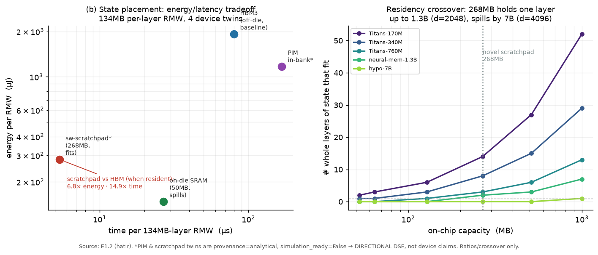
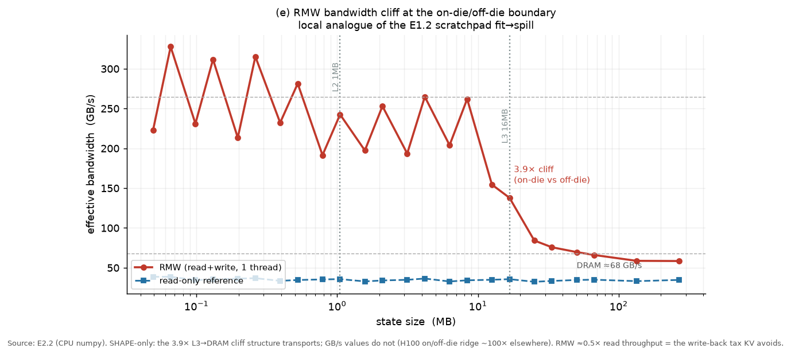
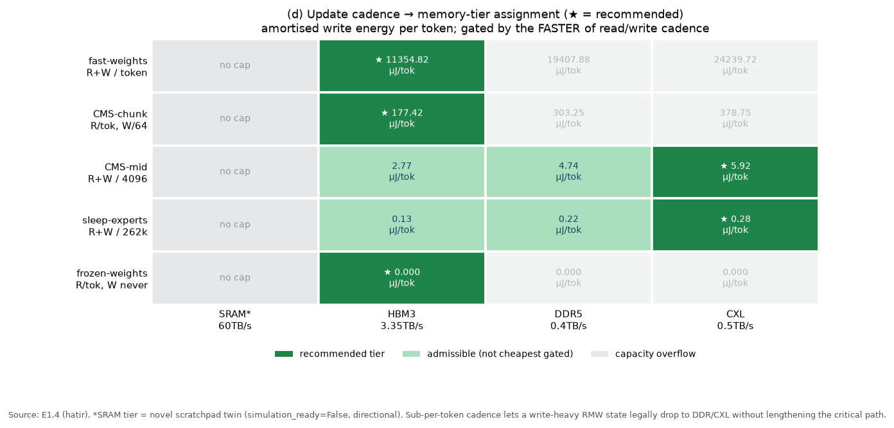

# ch24. 제안: 알고리즘 레벨과 하드웨어 레벨

> **이 장의 목표** — 독자가 이 장을 마치면 (1) 이 라인을 검증하고 밀어붙이기 위한 **알고리즘 레벨 제안** — 이미 돌린 소규모 실험이 무엇을 확정했고, 그것이 어느 falsifiable 대형 실험(train/serve chunk-consistency, state-capacity scaling)과 HOPE/Sleep 재현 runbook으로 이어지는지 — 을 진술할 수 있고, (2) **하드웨어 레벨 제안**을 D4 pair thesis의 두 절반으로 나눠, memory-centric 쪽(RMW-bandwidth decode 소자, frequency-tiered placement)과 accelerator 쪽(fused chunk kernel, grouped-GEMM decode engine, backward-capable serving kernel)을 **쌍으로** 제시할 수 있으며, (3) 그 사이에 놓이는 소프트웨어 제안(per-session-weights serving 스택)과, 이 책이 **명시적으로 배제**하는 두 FORCED 방향(훈련용 새 메모리 소자, 일반 PIM 옹호)을 구별할 수 있어야 한다.
> **왜 필요한가** — 19–23장은 pair thesis의 두 절반을 각각 측정하고 투영했다. 이 장은 그 측정을 **설계 제안**으로 바꾼다. 제안은 pair thesis의 규율을 그대로 물려받는다: memory-centric 논증은 정직 판정이 인정한 두 지점(decode RMW 트래픽, update-frequency↔tier)에서만 펴고, 나머지는 accelerator 쪽 제안으로 배치한다. 흥미로운 하드웨어 제안은 어느 한쪽이 아니라 **쌍**이라는 18장의 명제(§18.3)가 이 장의 조직 원리다.

## 24.1 Bridge-in: 측정에서 제안으로

23장은 TNT 경제학을 7–70B로 외삽하고 per-session weight state를 새 cache class로 세우며 pair thesis의 serving 절반을 투영으로 닫았다. 남은 것은 그 투영이 가리키는 **구체적 다음 수** — 무엇을 실험하고, 무엇을 만들 것인가 — 를 명제로 내리는 일이다. 이 장은 그것을 세 층으로 편다: 알고리즘(§24.2), 하드웨어(§24.3–§24.5), 그리고 배제(§24.6).

제안 전체를 관통하는 한 문장을 먼저 고정한다. **decode/serving-state 관리는 memory-centric 기회이고, training/prefill은 accelerator 영역이다**(D4 pair thesis, → 18장 §18.3). 이 장의 모든 하드웨어 제안은 이 분할의 어느 쪽에 속하는지로 정당성을 얻는다. memory-centric 제안이 정당한 이유는 그것이 논문들 자신의 cost accounting — token마다 fast-weight state 전체를 read-modify-write(RMW)하는 트래픽 — 에 근거하기 때문이고(§18.2의 두 진짜 지점), accelerator 제안이 정당한 이유는 같은 알고리즘이 chunk 크기 $C$를 키우면 compute-bound로 옮겨 가기 때문이다. 두 제안이 하나의 workload를 나눠 맡는다는 점이 이 장의 유일한 새 주장이다.

정직성 계약(→ 18장 §18.6)은 이 장에도 그대로 적용된다. 아래 인용하는 실측 수치 중 **load-bearing으로 승격되는 것은 비율·crossover 위치·tier 순서·bound class뿐**이다. 절대 µs/token·mJ/token은 roofline 하한이고 사내 A100 runbook(Part III-a)으로 이월된다. novel scratchpad·PIM twin의 이득 배율은 `simulation_ready=False`인 directional DSE로만 인용한다. 이 계약이 특히 이 장에서 중요한 이유는, 제안은 미래형이라 과장의 유혹이 가장 크기 때문이다.

## 24.2 알고리즘 레벨 제안

### 24.2.1 이미 확정한 것: 두 microbench가 고정한 곡선

Part III는 pair thesis를 8개 실험으로 측정했고(→ 18장 표 18-1), 그중 두 CPU microbench가 **알고리즘 레벨의 곡선 모양**을 하드웨어 불문으로 고정했다. 이 둘은 제안의 출발점이자 이후 대형 실험의 기대값이다.

첫째, **chunk $C$가 roofline의 x축이다**(claim7, E2.1). host roofline에서 $C{=}1$의 per-token rank-1 RMW — 이것이 곧 TTT decode 영역이다 — 은 arithmetic intensity 약 1 FLOP/byte로 memory-bound 평원(host roofline의 약 12%)에 붙어 있고, $C$를 키우면 crossover를 넘어 compute-bound로 오른다: **한 알고리즘, 두 영역**. crossover 위치의 절대값($C^*{\approx}32$ host)은 ridge 의존적이라 H100으로 옮기지 않는다(H100 closed-form $C^*\approx306$–$430$, → 9장·15장). 이전되는 것은 곡선의 **모양**과 memory↔compute 교차의 **존재**뿐이다. 둘째, **on-die/off-die 경계에서 RMW 대역폭이 계단식으로 꺾인다**(claim8, E2.2): in-cache RMW 대비 DRAM으로 spill하면 유효 대역폭이 약 3.9× 붕괴하고, RMW는 read의 약 0.5× throughput만 낸다 — element당 2× 바이트를 움직이는, append-once KV가 피하는 **write-back 세(稅)** 를 직접 측정한 값이다(GB/s 절대값은 host 좌표, 이전 금지).

> **[해설]** 이 두 곡선은 대칭이다. 같은 rank-1 RMW가 decode에서는 memory-bound의 근원($C{=}1$)이고 prefill에서는 $C$를 키워 벗어나는 대상이다. 제안이 pair로 갈리는 알고리즘적 뿌리가 여기 있다 — 하드웨어 두 제안(§24.3, §24.4)은 이 한 곡선의 두 끝을 각각 겨냥한다.

### 24.2.2 대형 실험 제안 A: train/serve chunk-consistency

TNT의 chunk-size mismatch(→ 15장)는 라인 전체에서 **단일 설정의 한 그림**에만 근거한다: 550M Titans를 $C{=}64$로 훈련하면 $C{=}64$에서 ppl 13.78이던 것이 $C{=}8$ 서빙에서 36.45로 무너진다는 [TNT Fig. 2]. 이 그림에는 gating도 momentum도 없고, mismatch가 **왜** 생기는지에 대한 이론도 없다. TNT App. D는 gated/momentum 변형과의 합성을 명시적으로 유보했다.

> **[평가] 제안 A — chunk-consistency grid.** 100–150M 규모에서 (train chunk × inference chunk) 격자를 {plain GD, +momentum $S_t$, +retention gate $\alpha_t$} 세 update rule에 대해 돌린다. 목적은 두 가지다: (i) mismatch가 세 rule에서 모두 재현되는가, 아니면 momentum/gating이 그것을 완화하는가; (ii) 왜 over-specialization이 일어나는지의 loss-landscape probe. 이 실험은 어느 방향으로 떨어져도 publishable하다 — mismatch가 재현되면 TNT의 발견을 라인 전체로 일반화하는 것이고, gating/momentum에서 사라지면 TNT의 일반성 주장에 대한 **정직한 negative result**다. 비용은 TNT의 10B-token 예산을 축소 스케일에서 크게 밑돈다.

이 실험이 서 있는 알고리즘적 근거는 §24.2.1의 claim7 곡선이다: chunk 크기는 throughput knob이면서 **계산되는 함수 자체를 바꾸는 semantic hyperparameter**다(stale-snapshot 근사, → 9장). train/serve chunk가 다르면 함수가 다르다는 것이 mismatch의 뿌리이며, 이 실험은 그 뿌리가 gate·momentum에 얼마나 민감한지를 측정한다.

### 24.2.3 대형 실험 제안 B: state-capacity를 scaling 축으로

19장은 state-bytes와 capacity($O(d_k^p)$, → 14장의 $\phi^*$)를 params·tokens와 나란한 일급 scaling 축으로 제안했다. 그 제안을 실험으로 닫는 것이 제안 B다.

> **[평가] 제안 B — capacity scaling fit.** 3–4개 크기 × 3개 architecture class(matrix memory, deep-MLP memory, deep+featurized memory)를 **동일 토큰**으로 훈련하고, ppl을 (params, state-bytes, capacity-proxy)에 대해 fit한다. 핵심 질문: capacity-proxy가 raw state-bytes보다 long-context 벤치마크를 더 잘 예측하는가. falsifier는 정직하게 둘이다 — (i) 공개 점들이 tokenizer·데이터가 이질적(라인 전반 Llama-2 vs T5 vocab)이라 cross-architecture fit이 불안정하고, (ii) 자체 run이 exponent를 안정화하기엔 너무 작을 수 있다. 이 실험은 안정적 exponent가 아니라 **capacity 축의 예측력 유무**를 판정하는 것이 목표다.

### 24.2.4 이 실험들의 vehicle: HOPE/Sleep 재현 runbook

제안 A·B와, 라인 전체의 부재한 decode wall-clock(6편 전부 미공개, → 18장 §18.2)을 실측하려면 실행 가능한 재현 경로가 있어야 한다. 정찰 결과는 냉정하다: **6편 전부 공식 구현이 없고**, 사실상의 reference는 lucidrains/titans-pytorch 하나이며 그마저 논문 밖 확장이 섞여 있다. HOPE는 비공식 2종(84★/76★)이 소규모·단일 GPU 수준으로만 존재하고, **Sleep의 wake/sleep 파이프라인은 지구상에 구현이 0개**다.

> **[평가] 제안 C — 하이브리드 4층 runbook.** (1) 베이스라인·백본 = flash-linear-attention + flame(공식급, multi-GPU 검증됨); (2) Titans neural memory = lucidrains 참조를 **논문 모드로 flag 고정**하고 `fla/ops/titans` naive를 수치 oracle로 병용; (3) HOPE = 자체 구현(비공식 2종은 참조·감사 대상이지 신뢰 기반 아님 — 둘 다 surrogate loss를 섞으므로 fork하면 "무엇을 측정했는지"가 모호해진다); (4) Sleep/Dreaming = 완전 자체 구현. 4층은 제안 A·B의 model-training 실험과 A100 runbook의 wall-clock 실측을 동시에 실어 나른다. Sleep 구현은 이 스터디의 잠재적 오픈소스 기여 지점이다.

이 runbook이 memory-centric 서사에 종속되지 않는다는 점을 분명히 한다. runbook의 1차 산출물은 알고리즘 검증(chunk semantics, capacity 예측력)과 절대 wall-clock이며, 그 wall-clock이 나와야 §24.3의 하드웨어 제안의 절대값 하한이 검증 가능한 실측으로 바뀐다. 즉 알고리즘 제안이 하드웨어 제안의 warrant를 공급한다.

## 24.3 하드웨어 레벨 — memory-centric 절반

이 절의 두 제안은 pair thesis가 인정한 **진짜 두 지점**에서만 나온다. 그 밖의 memory-centric 주장은 §24.6에서 명시적으로 배제한다.

### 24.3.1 RMW-bandwidth decode 소자

decode step은 anchor(neural-mem-1.3B)에서 token마다 6.44 GB를 움직이고 arithmetic intensity가 0.59 FLOP/byte로, H100 twin ridge 295 FLOP/byte보다 두 자릿수 아래다 — **결정적으로 memory-bound**이고, state RMW 트래픽이 decode step의 GEMV 연산을 약 394× 압도한다(claim1, E1.1/E3). **step 비용이 곧 state 트래픽이다.** 이 트래픽은 모델 폭에 따라 $m\,d^2\,L_{\mathrm{layer}}$로 자라 0.45→6.44→343 GB/token(Titans-170M→가상 70B)으로 증가하고, KV와 달리 문맥에 무관하게 일정하다. (절대 1.92 ms/token·46.5 mJ/token은 roofline 하한이며 A100 runbook으로 이월한다 — 본문이 딛는 것은 memory-bound·RMW-지배라는 **구조**뿐이다.)

이 구조가 요구하는 소자의 성격은 분명하다: **높은 RMW 대역폭**, **per-tenant state residency**, 그리고 write-heavy elementwise epilogue를 위한 **near-memory update engine**. 근거는 두 실측이다. 첫째, TTT state 크기는 문맥에 무관하게 $(d, m, L)$로 고정되므로 on-chip 상주가 **설계 가능한 knob**이다(context에 따라 자라는 KV와 결정적으로 다른 지점, claim4/E1.2). state가 fit하는 폭에서는 268 MB scratchpad가 HBM3 대비 6.8× energy / 14.9× time 이득을 내지만(directional DSE), 폭이 커지면 spill한다 — residency crossover는 hidden dim $d^*{\approx}2896$이고, 268 MB 버퍼는 한 layer state를 $d{=}2048$(1.3B, 134 MB/layer)까지 담고 $d{=}4096$(7B, 537 MB/layer)에서 넘친다. whole-model 상주는 Titans-170M(226 MB) 하나만 fit하므로, **스케일에서 placement는 whole-model pin이 아니라 per-layer/streamed**다.

<!-- FIG: exp-b -->

그림 24-1 — 134 MB/layer RMW state를 device별로 배치했을 때의 energy·time과, 268 MB scratchpad가 한 layer state를 담을 수 있는 폭의 상한(residency crossover $d^*{\approx}2896$). state가 fit하는 구간에서만 scratchpad가 HBM3를 이기며, 이득 배율은 `simulation_ready=False`인 directional DSE다(실험 E1.2 재구성).

둘째, 이 상주/spill 불연속이 로컬 실측으로도 재현된다: on-die/off-die 경계에서 RMW 대역폭이 약 3.9× 꺾이는 cliff가 그것이다(claim8/E2.2, 그림 24-2). 소자 제안의 요지는 이 cliff의 **on-die 쪽에 layer state를 붙잡아 두는** 것이며, per-layer 단위로는 그것이 가능하다는 것이 E1.2/E1.4가 함께 보이는 결론이다.

<!-- FIG: exp-e -->

그림 24-2 — state가 on-chip cache에 상주하는 동안 RMW는 빠르고, 용량 경계를 넘겨 DRAM으로 spill하면 유효 대역폭이 약 3.9× 붕괴한다. RMW가 read의 약 0.5× throughput만 내는 것이 append-once KV가 피하는 write-back 세다. GB/s 절대값은 host 좌표이며 H100으로 이전하지 않는다 — 이전되는 것은 cliff의 **존재**뿐이다(실험 E2.2).

near-memory update engine에 대해서는 PIM이 **오직 write-heavy elementwise epilogue**(decay·renorm·AXPY)라는 소수 FLOP 지점에서만, 그것도 directional하게 등장한다. TTT epilogue의 약 3 MAC/elem에서 PIM은 1.6× energy 이득이나 2.1× latency 비용을 내고, rank-1에 가까운 1 MAC/elem에서는 energy와 latency 둘 다 이득이다(claim4/E1.2). latency 비용은 약 3 MAC/elem을 넘겨야 물린다.

> **[평가] 제안 D — RMW-bandwidth decode 소자.** high-RMW-bandwidth state residency(per-layer 상주를 겨냥한 on-die/scratchpad 계층) + per-tenant state placement + elementwise epilogue를 위한 near-memory update path. 이 제안은 논문들의 cost accounting에 **근거한 것이지 그 위에 얹은 것이 아니다** — decode가 memory-bound whole-state RMW라는 사실은 measured structure이고, epilogue의 PIM 적합성은 minority-FLOP·directional로 한정된다. 절대 이득 배율은 silicon 검증 전까지 directional로만 인용한다.

### 24.3.2 frequency-tiered memory placement

두 번째 memory-centric 지점은 NL/Sleep의 update-frequency 정의에서 **직역**된다. Nested Learning(HOPE)과 Sleep은 각 memory level에 update cadence를 부여한다(per-token fast weights → chunk 주기 CMS level → sleep 주기 grown expert → frozen weights, → 16장·17장). 이 cadence는 memory 계층의 tier 배치 사양으로 거의 문자 그대로 번역된다(claim5/E1.4).

번역의 규칙은 하나다: **상주 사본은 read/write 중 빠른 쪽 cadence로 tier가 정해진다**(gating rule). 그 귀결이 placement 표다 — per-token fast weights는 HBM3에 pin되고; per-token read이되 chunk 단위 write인 CMS-chunk level은 read cadence가 뜨겁게 붙잡아 HBM3에 남으며; read·write가 모두 4096 token 주기로 down-sample된 CMS-mid level은 CXL로 legally 내려가고; offline cadence의 Sleep-consolidated expert도 CXL로 간다; frozen weights는 per-token read라 HBM3의 read-heavy(accelerator-friendly) 쪽에 놓인다. 핵심 통찰은 **sub-per-token access cadence가 트래픽을 critical path 아래로 amortise한다**는 것이다 — write-heavy RMW state라도 갱신 주기가 길면 느린 tier가 허용된다.

<!-- FIG: exp-d -->

그림 24-3 — CMS level별 update 주기(행)와 memory tier(열)의 허용 관계. latency tolerance가 update 주기에 선형으로 넓어지므로($P_{\text{read}}\cdot t_{\text{tok}}$), down-sampled level일수록 싼 tier가 legally 허용된다. per-layer fast-weight block(67 MB)은 268 MB scratchpad에 fit해 HBM3 대비 7.4× energy 이득을 내지만 all-layer는 fit하지 않는다(실험 E1.4, scratchpad 이득은 directional).

> **[평가] 제안 E — frequency-tiered placement engine.** update-frequency 연속체를 tier admissibility 규칙으로 소비하는 배치 계층: hot fast-weights를 HBM3/on-die에, down-sampled CMS-mid를 DDR/CXL-class latency로, sleep-consolidated expert를 명시적 data-migration 스케줄로. 이것은 이 스터디에서 가장 신선한 memory-architecture 주장이다 — NL/Sleep의 정의가 **이미** memory-hierarchy 사양이라는 것을 어떤 선행 연구도 진술하지 않았고, 매핑이 거의 문자 그대로이기 때문이다. 다만 이 규칙은 cadence를 tier의 **한 입력 변수**로 삼는 directional 가설이지 단독 admissibility 법칙이 아니다: 드문 접근이 평균 대역폭·energy를 amortise하더라도, 그 접근이 실제로 일어나는 token은 prefetch·비동기 실행이 없으면 여전히 느린 tier의 **동기 latency**를 문다. 따라서 CXL 배치의 실 admissibility에는 cadence 외에 transfer size, link latency, prefetch window, 동시 상주 sequence 수가 함께 들어가며, 이 tier 판정은 `simulation_ready=False`인 directional DSE로만 인용한다.

## 24.4 하드웨어 레벨 — accelerator 절반 (pair의 다른 쪽)

memory-centric 제안(D·E)은 pair thesis의 절반일 뿐이다. training/prefill과 decode의 dense-matmul 부분은 accelerator 영역이며, 여기서의 승부는 kernel에서 난다. 세 제안이 §24.2.1의 claim7 곡선의 compute-bound 끝을 겨냥한다.

**제안 F — fused chunk kernel.** claim7이 보이듯 $C$를 키우면 chunkwise scan이 compute-bound로 오른다. 그런데 정찰 증거는 이 kernel이 **아직 없다**는 것을 구조적으로 드러낸다: flash-linear-attention의 `fla/ops/ttt`는 진짜 Triton chunkwise 커널을 가졌지만, `fla/ops/titans`는 naive PyTorch 참조 구현에만 머문다. TTT만 Triton화되고 Titans가 naive에 남은 이 사실 자체가 **momentum 항이 chunkwise closed form을 깨뜨린다**는 9장·15장 서사의 생태계 측 물증이다. 제안은 momentum·retention을 포함한 deep-memory chunk를 fuse하는 커널이며, 이것이 라인이 아직 기다리는 "FlashAttention-moment"의 후보다(→ 21장). TNT가 plain JAX만으로 32K에서 step당 FlashAttention을 이미 이겼다는 점(→ 15장)이 이 방향의 상한이 존재함을 시사한다. (단, TNT는 momentum·gating·Muon을 "명료성을 위해" 제거한 단순화 Titans로 검증했으므로 — App. D — 라인 전체와의 합성은 미검증이다.)

**제안 G — grouped-GEMM decode engine.** per-request mutable fast weights는 shared-weight batching을 **깨뜨린다**(→ 23장, 1장 Rosetta의 batching 행). token마다 request별로 다른 $W$를 RMW하므로, 오늘의 decode kernel이 전제하는 "여러 request가 같은 weight를 공유한다"가 성립하지 않는다. 제안은 request별 state를 batch 축으로 묶어 처리하는 grouped-GEMM decode path다. 이것이 accelerator 제안인 이유는, batch가 HBM 대역폭에 먼저 막히더라도(claim3, capacity-bound KV와 정반대) GEMV들을 grouped-GEMM으로 재조직하면 arithmetic intensity를 끌어올려 memory-bound 평원에서 부분적으로 벗어날 수 있기 때문이다.

**제안 H — backward-capable serving kernel.** 이 라인의 decode는 inference인데 **backward pass를 품는다** — inner loop이 $\nabla_W \ell$를 계산해 state를 갱신하기 때문이다(→ 1장 Rosetta의 "backward pass가 decode에 들어온다", 8장). 오늘의 serving kernel은 forward-only로 설계되어 있어 이 primitive를 지원하지 않는다. 제안은 decode 경로에 inner-loop backward를 일급 연산으로 포함하는 serving kernel이다. NS-5(Newton–Schulz, → 14장)와 deep-memory의 FLOP density가 여기서 accelerator 자원을 요구하는 지점이며(→ 20장), 이것은 memory-centric 소자가 아니라 tensor-core 영역의 문제다.

> **[평가]** 제안 F·G·H는 D·E와 **경쟁하지 않고 짝을 이룬다**. decode의 state 트래픽은 memory-centric 소자(D)가 흡수하고, decode의 backward 연산과 batching 재조직은 accelerator kernel(G·H)이 맡으며, prefill/training의 compute-bound chunk는 fused kernel(F)이 처리한다. 어느 한쪽만 옹호하는 제안은 workload의 절반을 무시한다 — 이것이 18장 pair thesis의 실천적 귀결이다.

## 24.5 소프트웨어 제안: per-session-weights serving 스택

하드웨어 제안 사이에 소프트웨어 층이 놓인다. 기존 KV-cache manager의 semantics는 RMW state에 대해 **범주 오류**임이 코드 레벨에서 확인된다(claim6/E1.5, `hat-kv-manager/manager.py` 근거). 세 gap이 결정적이다: (G1) content-addressed prefix reuse — manager의 1번 가치, KV에서 0.5 hit-rate — 가 RMW state에서는 **구조적으로 0**이다(content가 token마다 변이해 block hash가 재현되지 않음). 단 이 0은 **content-addressed(block-hash) 재사용에 한정**된다 — 같은 prefix를 결정론적으로 처리한 서로 다른 요청은 분기 전까지 동일한 state snapshot에 도달하므로 prefix-snapshot 공유 + copy-on-write는 원리상 가능하며, append-only KVCacheManager가 그 mutable-state 재사용을 표현할 API를 갖지 못한 것이 바로 새 manager가 필요한 이유다; (G2) in-place update 없는 append-only placement가 T개의 stale 버전을 쌓아 256 token에서 참 working set의 **256×**로 부푼다; (G3) `_evict_from()`이 dirty state를 clean/recomputable로 가정해 **무료로 drop**하는데, 실제 TTT eviction은 full writeback을 진다(anchor에서 약 3.05 mJ / 130 µs — NO-WALLCLOCK, A100 runbook 이월).

그 귀결로 TTT-state manager는 KVCacheManager에 없는 다섯 event type을 요구한다(claim6). 이것을 그대로 per-session-weights serving 설계로 옮긴다.

> **[평가] 제안 I — per-session-weights serving stack.** claim6의 다섯 누락 API를 설계 표면으로 삼는다.
> - `update_in_place(slot)` — append가 아니라 제자리 RMW. G2의 256× stale accretion을 원천 차단한다.
> - `mark_dirty / writeback(slot)` — 모든 TTT state는 항상 dirty이므로 eviction은 반드시 writeback을 가격한다. G3의 unpriced writeback을 명시적 비용으로 승격한다.
> - `checkpoint / rollback(seq)` — speculative decoding의 rollback이 optimizer-trajectory state($W_t$와 momentum $S_t$)까지 되돌려야 한다(→ 23장). KV의 단순 truncate와 질적으로 다르다.
> - `bind_to_sequence(seq)` — state가 sequence별 unshared 사본이므로 배치는 sequence에 bind된다(prefix 공유 불가). §24.4 제안 G의 grouped-GEMM이 이 bind를 batch 축으로 묶는다.
> - `free_on_update(slot)` — retention gate $\alpha_t$가 **학습된 eviction**이므로(→ 1장 Rosetta), free는 policy가 아니라 모델 신호에 연동된다.
>
> 이 스택은 §24.3의 memory-centric 소자(state가 어디 사는가)와 §24.4의 accelerator kernel(state를 어떻게 계산하는가) 사이의 접착층이며, claim6의 semantic gap을 설계 요구사항으로 직접 번역한 것이다.

## 24.6 배제: FORCED 방향 두 가지

정직 판정(→ 18장 §18.3, dossier §5 verdict)이 **금지**한 두 memory-centric 방향을 이 장은 명시적으로 배제한다. 배제 자체가 pair thesis의 규율을 지키는 행위다.

**배제 1 — "이 라인의 훈련이 새 메모리 소자를 요구한다."** 증거는 반대 방향을 가리킨다. 여섯 편이 연속으로 알고리즘을 **dense matmul로 다시 빚어** 기존 accelerator에 맞췄다: chunk anchoring, banded mask, batched NS-5, parallelism을 위한 reset. TNT는 plain JAX로 stock TPU 위에서 FlashAttention을 이겼다(→ 15장). training/prefill은 tensor-core 영역이며 앞으로도 그렇다 — 여기서 device-level 필요성을 주장하는 것은 이 라인의 중심 엔지니어링 패턴과 모순된다. 훈련 쪽 제안은 그래서 §24.4의 accelerator kernel(F)이지 새 소자가 아니다.

**배제 2 — 일반 PIM 옹호.** per-token update는 MLP를 통한 gradient 계산으로 GEMV/GEMM 형태이지, 대부분의 PIM 제안을 정당화하는 sparse·irregular access 패턴이 아니다. PIM 형태인 것은 elementwise state-update epilogue(AXPY·decay·renorm)뿐이며, 그것은 FLOP의 소수다(§24.3.1). 따라서 PIM은 일반 해법이 아니라 epilogue 국소의 directional 옵션으로만 등장한다.

> **[평가]** 이 두 배제는 memory-centric 논증을 약화하는 것이 아니라 **신뢰 가능하게** 만든다. decode RMW 트래픽(제안 D)과 update-frequency↔tier(제안 E)라는 두 지점은 논문들 자신의 cost accounting에 뿌리내렸기에 살아남고, 훈련용 새 소자와 일반 PIM은 논문들 자신의 증거에 반하기에 배제된다. 종합 view는 이 라인이 memory-centric **이면서** accelerator-centric이라는 것이다 — 한 workload의 두 절반이기 때문이다.

## 요약

- 알고리즘 제안은 세 층이다. 두 CPU microbench가 chunk $C$-roofline 곡선(claim7)과 on/off-die RMW cliff(claim8)의 **모양**을 하드웨어 불문으로 고정했고, 이것이 제안 A(train/serve chunk-consistency grid)와 제안 B(state-capacity scaling fit)의 기대값이며, 두 실험의 vehicle은 하이브리드 4층 HOPE/Sleep 재현 runbook(제안 C)이다.
- 하드웨어 memory-centric 절반은 정직 판정의 두 지점에서만 나온다: 제안 D(RMW-bandwidth decode 소자 — per-layer residency, per-tenant placement, near-memory epilogue engine; claim1/4/8)와 제안 E(frequency-tiered placement — NL/Sleep cadence의 tier 직역; claim5).
- accelerator 절반이 그 짝이다: 제안 F(fused chunk kernel — momentum이 깨뜨린 chunkwise closed form의 미해결 커널), 제안 G(grouped-GEMM decode engine — per-request weights가 깬 batching 복원), 제안 H(backward-capable serving kernel — decode에 들어온 backward primitive).
- 소프트웨어 접착층은 제안 I(per-session-weights serving stack)로, claim6의 다섯 누락 API(`update_in_place`·`mark_dirty/writeback`·`checkpoint/rollback`·`bind_to_sequence`·`free_on_update`)를 설계 요구사항으로 번역한다.
- 두 FORCED 방향 — 훈련용 새 소자, 일반 PIM — 은 논문들 자신의 증거(알고리즘을 dense matmul로 다시 빚음)에 반하므로 명시적으로 배제한다. 흥미로운 하드웨어 제안은 어느 한쪽이 아니라 **쌍**이다.
- 모든 수치는 exploration-grade 계약 아래 읽는다: 비율·crossover·tier·bound만 load-bearing, 절대 µs/mJ은 roofline 하한(A100 runbook 이월), scratchpad/PIM 이득 배율은 directional.

## 자가 점검 체크리스트

- [ ] 알고리즘 제안 A·B가 각각 무엇을 falsify하려 하고, 어느 방향으로 떨어져도 왜 publishable인지 설명할 수 있다.
- [ ] HOPE/Sleep 재현이 왜 하이브리드 4층으로 강제되는지(공식 구현 0, Sleep 구현 0)를 진술할 수 있다.
- [ ] memory-centric 제안 D·E가 정직 판정의 어느 두 지점에 근거하는지, 그리고 각 근거 claim을 짚을 수 있다.
- [ ] accelerator 제안 F·G·H가 memory-centric 제안과 경쟁이 아니라 pair를 이루는 이유를 설명할 수 있다.
- [ ] claim6의 다섯 누락 API가 per-session-weights serving 설계로 어떻게 번역되는지 대응시킬 수 있다.
- [ ] 배제되는 두 FORCED 방향과, 그 배제가 memory-centric 논증을 왜 오히려 신뢰 가능하게 만드는지 말할 수 있다.
- [ ] 어떤 제안 수치가 load-bearing 비율·crossover이고 어떤 것이 directional·이월 하한인지 판별할 수 있다.

## 다음 장으로

이 장은 pair thesis의 두 절반을 각각의 제안 — 알고리즘 실험, memory-centric 소자, accelerator kernel, serving 소프트웨어 — 으로 내렸다. 25장은 이 제안들을 하나의 research agenda로 묶고, 이 라인이 열어 둔 다섯 공백(스케일, retrieval 격차, serving 경제학·kernel, 학습되는 스케줄, task-free·안전한 self-modification, → 18장 §18.2)에 이 책의 기여가 어디에 놓이는지를 정리하며 스터디를 닫는다.
